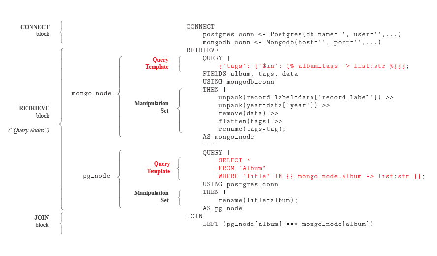

***

Query Graph is a framework/language, written in Python, for joining data 
from different database management systems - i.e. joins that can't 
typically be accomplished with a single query. For example, joining 
Postgres data and Mongo Db data. It also provides tools for easily 
converting non-tabular data (e.g. JSON) into tabular form.

The following databases are currently supported:

* Sqlite
* MySQL
* Postgres
* Mongo Db
* Elastic Search
* Apache Cassandra (untested)
* Maria Db (untested)
* InfluxDB (untested)
* MS Sql (untested)

## Main Features

* Join data from any number of different database types in a single query.
* Manipulate data using "manipulation sets", which are chained together
  statements very similar to those used in the `dplyr` package for R.
  ```
  mutate(new_col=log(old_col)) >>
  remove(some_column)
  ```
* Easily transform JSON-like data into relational form.
* Threading can optionally be used to run queries on different databases
  simultaneously, based the structure of the query graph.

## Getting Started

* To install Query Graph, see below.
* For a brief introduction to Query Graph, see here.
* For a more complete introduction, see here.
* For documentation, see here.

## Installation

To install Query Graph...

# Query Graph Language - Brief Introduction

Query Graph Language (QGL) is a simple, domain specific declarative 
language. The best way to give an idea of how it works is through
an example. In the example, we'll be joining data from two databases:
a Mongo Db database, and a Postgres database.

## The Mongo Db Database

The Mongo Db database contains a collection, `albums`, with data in the 
following form:

```
{
      "album": "Jagged Little Pill",
      "tags": [
        "canada",
        "pop rock",
        "post-grunge",
        "female"
      ],
      "data": {"record_label": "Maverick",
               "year": 1995}
}
```

## The Postgres Database

The Postgres database contains a table, `Albums`, that is structured in
the following manner:

| AlbumId | Title              | ArtistId |
|---------|--------------------|----------|
| ...     | ...                | ...      |
| 6       | Jagged Little Pill | 4        |
| ...     | ...                | ...      |


## The QGL Query

The QGL query used to join both sets of data is below.

```
CONNECT
    postgres_conn <- Postgres(db_name='', user='', password='', host='', port='')
    mongodb_conn <- Mongodb(host='', port='', db_name='', collection='')
RETRIEVE
    QUERY |
        {'tags': {'$in': }};
    FIELDS album, tags, data
    USING mongodb_conn
    THEN |
        unpack(record_label=data['record_label']) >>
        unpack(year=data['year']) >>
        remove(data) >>
        flatten(tags) >>
        rename(tags=tag);
    AS mongo_node
    ---
    QUERY |
        SELECT *
        FROM "Album"
        WHERE "Title" IN {{ mongo_node.album -> list:str }};
    USING postgres_conn
    THEN |
        rename(Title=album);
    AS postgres_node
JOIN
    LEFT (pg_node[album] ==> mongo_node[album])
```

To execute the query in Python, the code is

```python
query_str = "..." # The string defined above.

# Create the graph instance.
query_graph = QueryGraph(qgl_str=query_str)

# Execute the graph and get a dataframe in return.
df = query_graph.execute(album_tags=['canada', 'rock'])
```

The output is a Pandas dataframe:

| AlbumId | album | ArtistId | tag | record_label | year |
|---------|-------|----------|-----|--------------|------|
| ...     | ...   | ...      | ... | ...          | ...  |
| ...     | ...   | ...      | ... | ...          | ...  |
| ...     | ...   | ...      | ... | ...          | ...  |

Now we'll walk through the query and each step of its execution.

## Walkthrough

The basic structure of our example query is broken down in the diagram
below. The `CONNECT` block establishes connections to the databases
that will be queried upon execution. The `RETRIEVE` block is where
"query nodes" are defined, and each query node represents a query on 
a single database. The `JOIN` block describes how the data results of 
each query node are joined.




### `mongo_node` Execution

When our example query is executed, the first thing to happen is the
rendering of the "query template" belonging to the `mongo_node` query
node. A query template is simply a query written in the form appropriate
for whatever database type it will be executed on, augmented with
"template parameters". The `mongo_node` query template has a single 
"independent" parameter:


The parameter is "independent" because its value is defined before the
query is executed (as opposed to "dependent" parameters, which are 
covered below). The parameter "value expression" defines the value
assigned to the parameter. In our case, we defined

```python
album_tags=['canada', 'rock']
```

The "container type" and "render type" indicate that the value defined
above should be rendered as a list of strings. The rendered query for
`mongo_node` is:

```
{'tags': {'$in': ['canada', 'rock']}}
```

which is just an ordinary Mongo Db query (using their Python API). The
query is then executed using the `mongo_conn` connector, with only the
fields "album", "tags", and "data" selected. The dataframe returned
looks something like this:

| album              | tags                                           | data                                        |
|--------------------|------------------------------------------------|---------------------------------------------|
| Jagged Little Pill | `["canada","pop rock","post-grunge","female"]` | `{"record_label": "Maverick","year": 1995}` |
| ...                | ...                                            | ...                                         |
| ...                | ...                                            | ...                                         |

The `mongo_node`'s "manipulation set", shown below, is now executed on the dataframe
shown above. A manipulation set is a chained set of statements very
similar to those from the `dplyr` R package - just replace `%>%` with
`>>`.

```
unpack(record_label=data['record_label']) >>
unpack(year=data['year']) >>
remove(data) >>
flatten(tags) >>
rename(tags=tag)
```

The `mongo_node`'s manipulation set does the following:

1. "Unpacks" the `record_label` value of the dictionary contained
in the `data` column and stores it in a new column called `record_label`.
2. Does the same for `year`.
3. Removes the `data` column.
4. "Flattens" the `tags` column - creates a new row for each item in
every list contained in the column.
5. Renames `tags` to `tag`.

The dataframe belonging to `mongo_node` node now looks like this:

| album              | tag         | record_label | year |
|--------------------|-------------|--------------|------|
| Jagged Little Pill | canada      | Maverick     | 1995 |
| Jagged Little Pill | pop rock    | Maverick     | 1995 |
| Jagged Little Pill | post-grunge | Maverick     | 1995 |
| ...                | ...         | ...          | ...  |


### `pg_node` Execution

With the `mongo_node`'s query having been executed and results retrieved, the
query template belonging to the `pg_node` query node is rendered. Whereas
the `mongo_node`'s query template had a single "independent" parameter,
the `pg_node`'s query template has a single "dependent" parameter:


The difference is that the value expression of a dependent parameter
draws from the result of its query node's "parent" - in this case
`mongo_node` - as opposed to variables defined prior to execution. More
specifically, it references the unique values of the columns of the 
dataframe belonging to the parent node. The rendered query template
belonging to `pg_node` is:

```
SELECT *
FROM "Album"
WHERE "Title" IN ('Jagged Little Pill')
```

So the parameter used the unique values of the `album` column from
`mongo_node` to render a list of strings in the form appropriate
for a Postgres SQL query. The rendered query is then executed using the
`postgres_conn` database connector and the resulting dataframe is shown 
below:

| AlbumId | Title              | ArtistId |
|---------|--------------------|----------|
| 6       | Jagged Little Pill | 4        |

The `pg_node` also has a manipulation set, which contains a single
manipulation renaming the `Title` column to `album`. The final step
is to join the results of both query nodes.

### Joining

The dataframes of `pg_node` and `mongo_node` are joined according to the
statement provided in the `JOIN` block:

```
LEFT (pg_node[album] ==> mongo_node[album])
```

The statement says a LEFT join should be performed using the `album` 
column from `pg_node`'s dataframe, and the `album` column from 
`mongo_node`'s dataframe. If more than one column was required for
joining they would be listed in the brackets beside each node name.

The final output of our example query's execution is below.

| album              | tag         | record_label | year | AlbumId | ArtistId |
|--------------------|-------------|--------------|------|---------|----------|
| Jagged Little Pill | canada      | Maverick     | 1995 | 6       | 4        |
| Jagged Little Pill | pop rock    | Maverick     | 1995 | 6       | 4        |
| Jagged Little Pill | post-grunge | Maverick     | 1995 | 6       | 4        |
| ...                | ...         | ...          | ...  | ...     | ...      |
