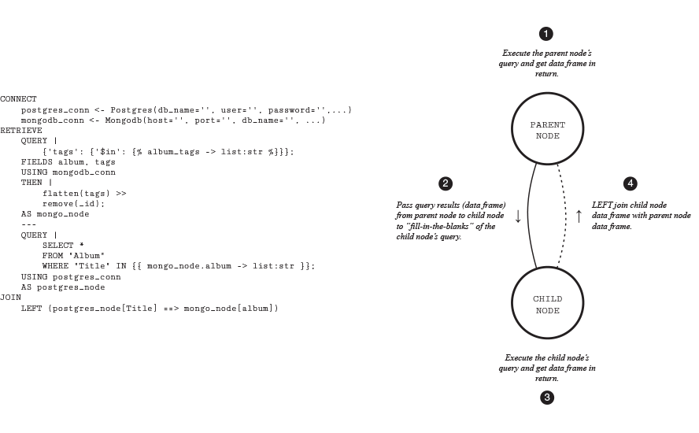
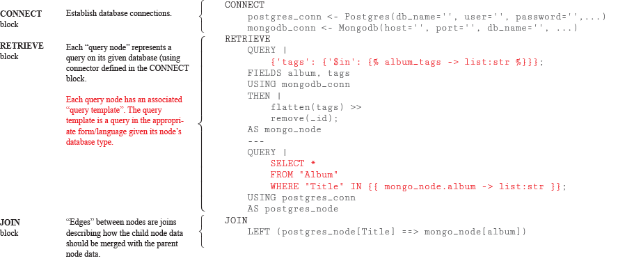
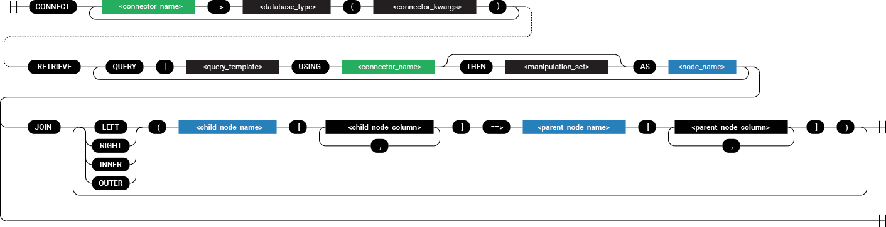

***

Query Graph is a framework/language, written in Python, for joining data 
from different database management systems - i.e. joins that can't 
typically be accomplished with a single query. For example, joining 
Postgres data and Mongo Db data. It also provides tools for easily 
converting non-tabular data (e.g. JSON) into tabular form.

The following databases are currently supported:

* Sqlite
* MySQL
* Postgres
* Mongo Db
* Elastic Search
* Apache Cassandra (untested)
* Maria Db (untested)
* InfluxDB (untested)

## Main Features

* Join data from any number of different database types in a single query.
* Manipulate data using "manipulation sets", which are chained together
  statements very similar to those used in the `dplyr` package for R.
  ```
  mutate(new_col=log(old_col)) >>
  remove(some_column)
  ```
* Easily transform JSON-like data into relational form.
* Threading can optionally be used to run queries on different databases
  simultaneously, based the structure of the query graph.

## Getting Started

* To install Query Graph, see below.
* For a brief introduction to Query Graph, see here.
* For a more complete introduction, see here.
* For documentation, see here.

## Installation

To install Query Graph...

## Brief Introduction

The basic building block of Query Graph are "query templates". A query
template is a query written in the appropriate form/language, given 
the type of database it is intended for (e.g. SQL), augmented with 
"template parameters".

A query graph is a directed, acyclic graph whose nodes each represent a
single query on a database. When two nodes are connected, the data 
resulting from the parent node's query is used to "fill-in-the-blanks" of
the child node's query.



### Example Query

___




```
CONNECT
    postgres_conn <- Postgres(db_name='%s', user='%s', password='%s', host='%s', port='%s')
    mongodb_conn <- Mongodb(host='%s', port='%s', db_name='%s', collection='%s')
RETRIEVE
    QUERY |
        {'tags': {'$in': }};
    FIELDS album, tags
    USING mongodb_conn
    THEN |
        flatten(tags) >>
        remove(_id);
    AS mongo_node
    ---
    QUERY |
        SELECT *
        FROM "Album"
        WHERE "Title" IN {{ album -> list:str }};
    USING postgres_conn
    AS postgres_node
JOIN
    LEFT (postgres_node[Title] ==> mongo_node[album])
```

## Query Graph Language

A QGL query consists of three primary 'blocks': the `CONNECT` block, 
the `RETRIEVE` block, and the `JOIN` block. The `CONNECT` block 
established database connections, the `RETRIEVE` block creates query
nodes, and the `JOIN` describes how the nodes are joined.



### Connect Block

Each connector in the `CONNECT` block points a name to a database
type and associated credentials. The railroad diagram below outlines
the syntax.


### Retrieve Block

The `RETRIEVE` block defines the graph's query nodes.


### Join Block

The `JOIN` block defines how the graph's query nodes are joined.

